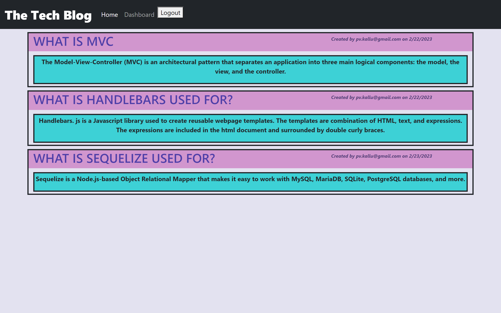

# Project Title: 14.Tech-Blog

## Description:
 This application can publish articles, blog posts, and the user's thoughts and opinions. Here, the users create their accounts. This enables them to add their posts and comment on other posts. The users can view the posts and visit links. Users can edit titles and content, and delete their posts.

## Installation:
 The following packages are to be installed:
  - express-handlebars
  - mysql2
  - sequelize 
  - dotenv
  - bcrypt
  - express-session
  - connect-session-sequelize
  - heroku

 ## Usage:
  The application can be invoked by following the `mysql -u root -p` command at the project root and entering the password when prompted. On the mysql prompt, a `source schema.sql` command is used to create a database and `quit` command is used to exit the mysql prompt. After creating the models(categories, products and tags) and routes, `npm run seed` is run to seed data to the database. The server is started using either `node server.js` or `npm start` commands.

  ### Deployed application URL from Heroku and screenshot:

    https://protected-peak-86316.herokuapp.com/ 

  

## License:

 

Read more about the MIT licence here: https://opensource.org/licenses/MIT.

## Questions?
  ### Reach me here: 
   My GitHub profile: [veerak21](https://github.com/veerak21),

   My E-mail: pv.kallu@gmail.com.

     

